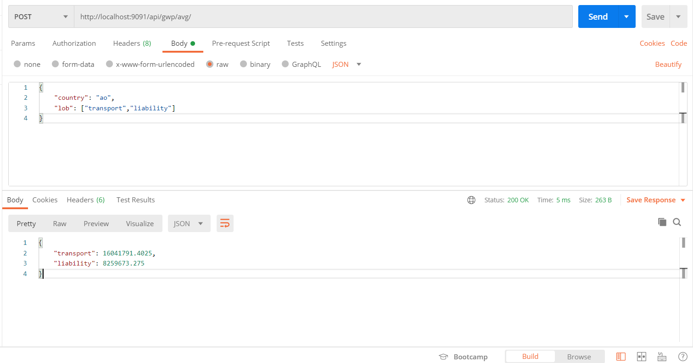

# GalytixAPI

Steps to run this API

Step 1: Open command prompt and navigate to API's present folder.

Step 2: Type command "npm install" in order to install all the required dependencies.

Step 3: Then, type command "node app.js" and hit enter.

Step 4: Send post request to the route http://localhost:9091/api/gwp/avg/ . This route will expect a country(string) and lines of business(array of strings) using postman(recommended).

Step 5: Check the desired response from the API is provided.

API uses following dependencies:

Express: For handling post requests from clients.

csvtojson: For converting csv file data to json data.

Bodyparser: For parsing data from client’s post request’s body to API.

Output: 

